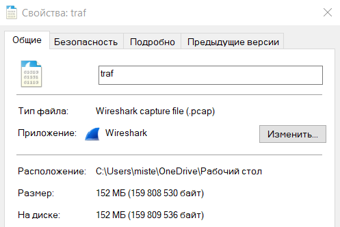

## Цель работы

1.  Развить практические навыки использования современного стека инструментов сбора и аналитической обработки информации о сетевом трафике
2.  Освоить базовые подходы блокировки нежелательного сетевого трафика
3.  Закрепить знания о современных сетевых протоколах прикладного уровня

## Исходные данные

1.  WLS(Ubuntu 22.04.2)
2.  Zeek
3.  Wireshark
4.  Windows 10
5.  RStudio
6.  PyCharm

## План работы

1.  Собрать сетевой трафик
2.  Выделить метаинформацию сетевого трафика с помощью утилиты Zeek
3.  Собрать данные об источниках нежелательного трафика
4.  Написать программу, которая подсчитает процент нежелательного трафика
5.  Оформить отчет

## Ход работы:

1.  Использую Wireshark для сбора трафика (захожу на различные ресурсы, чтобы получить большую выборку) с отключенным блокираторо рекламы. Получаем файл: traf.pcap (152 МБ)\
    
2.  Устанавливю WLS(Ubuntu) для работы с Zeek через Windows, передаю в него файл и получаю метаинформацию сетевого трафика:

/opt/zeek/bin/zeek -r /mnt/c/traf.pcap


3.  Соединяю в единый файл списки нежелательного трафика с репрозитория: [StevenBlack (Steven Black) · GitHub](https://github.com/StevenBlack) \
    Полученный файл: mal.txt\
    

4.  На языке python пишу программу, которая подсчитывает процент нежелательного трафика.\
    Преобразовываю файл dns из Zeek в датафрейм\
    Так же поступаю с файлом, полученным из онлайн репрозитория\
    Анализирую полученные датафреймы и получаю процент нежелательного трафика. В моём случае это 5,149%

``` python
import warnings
warnings.filterwarnings("ignore", category=RuntimeWarning)
import numpy as np
import pandas as pd
import zat.log_to_dataframe
df = zat.log_to_dataframe.LogToDataFrame()
zdf = df.create_dataframe('dns.log')
domain = zdf['query']
domain.name='CNAME'
df = pd.read_csv('mal.txt',sep="\s+",names=['redirect_to','CNAME'])
vred = df['CNAME']

mer = pd.merge(domain,vred, how='left',indicator='exists', on=['CNAME'],)
mer['exists'] = np.where(mer.exists == 'both',True,False)

final = mer['exists'].value_counts(normalize=True)[1]*100

print("Процент вредного трафика: ", round(final,3))
```


5.  Оформляю отчет в программе RStudio


## Вывод

В ходе данной работе я собирала трафик, работала с утилитой Zeek, писала программу, которая вычисляет процент нежелательного трафика, поэтому освоила базовые подходы блокировки нежелательного сетевого трафика, закрепила знания о современных сетевых протоколах прикладного уровня и приобрела практические навыки работы с утилитой Zeek.
