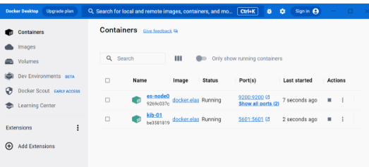
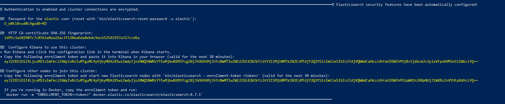
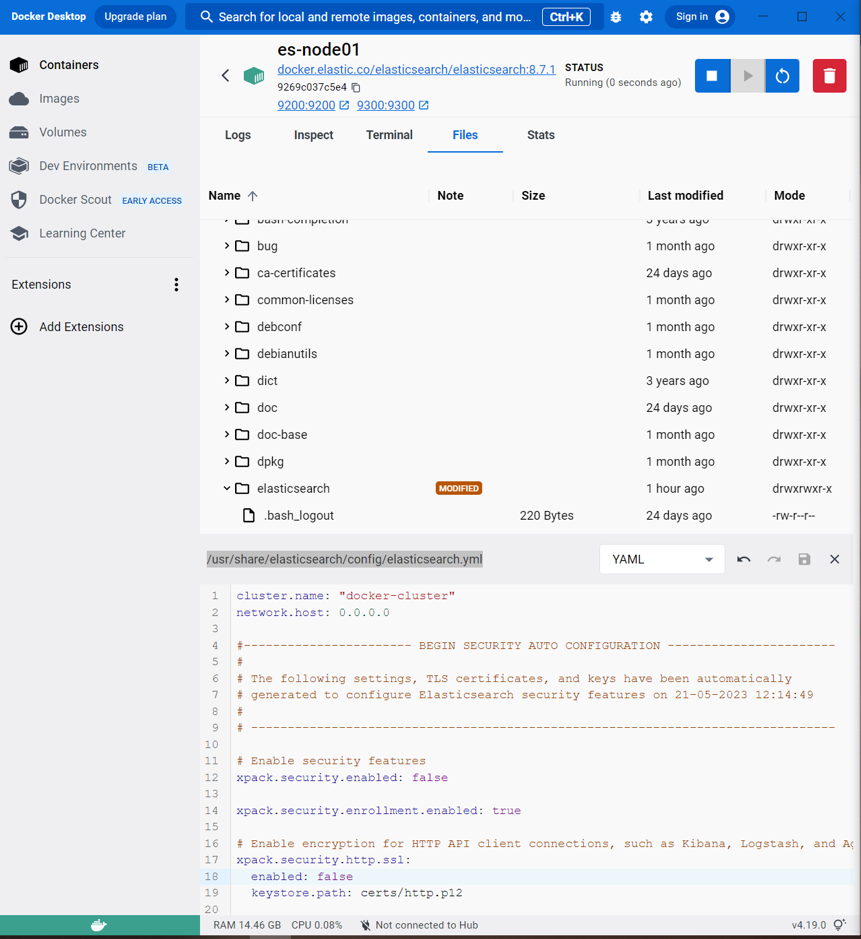
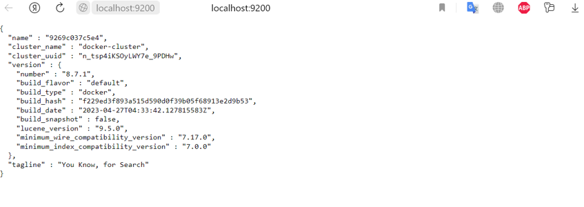
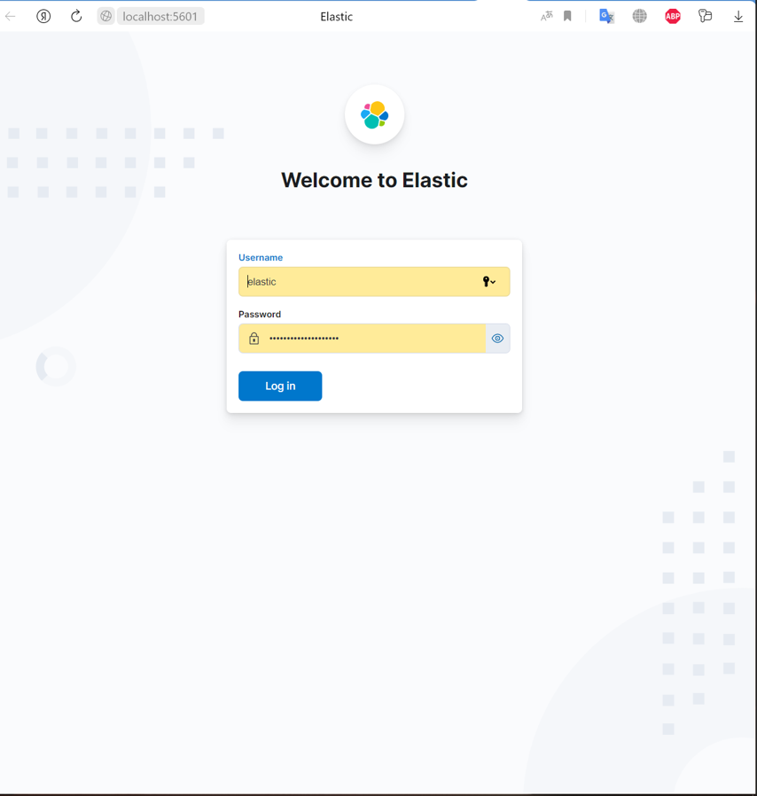
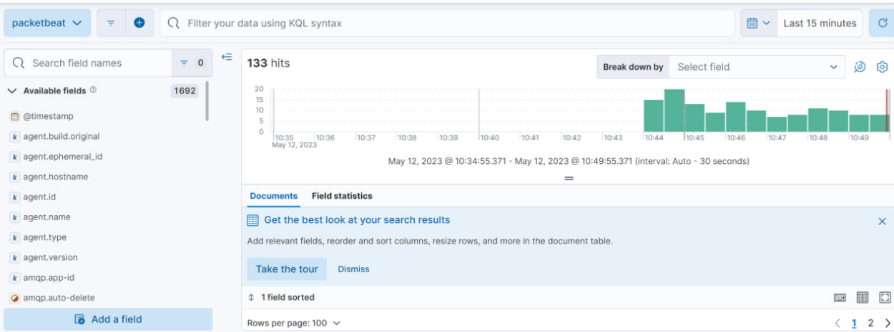
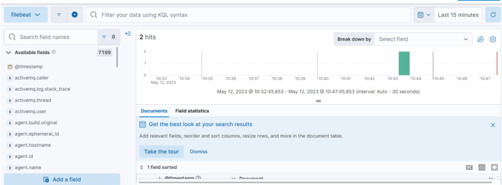

## Цель работы

1.  Освоить базовые подходы централизованного сбора и накопления информации
2.  Освоить современные инструменты развертывания контейнирозованных приложений
3.  Закрепить знания о современных сетевых протоколах прикладного уровня

## Исходные данные

1.  Docker
2.  Filebeat
3.  Packetbeat
4.  Windows 10
5.  RStudio
6.  Elasticsearch

## План работы

1.  Развернуть систему elasticsearch
2.  Настроить сбор информации о сетевом трафике
3.  Настроить сбор информации из файлов журналов (лог-файлов)
4.  Оформить отчет

## Ход работы:

1.  Устанавливаю Docker Desktop для Windows
2.  Устанавливаю elasticsearch и Kibana (VPN). Установка elasticsearch

> docker network create elastic

> docker pull docker.elastic.co/elasticsearch/elasticsearch:8.7.1

> docker run --name es-node01 --net elastic -p 9200:9200 -p 9300:9300 -t docker.elastic.co/elasticsearch/elasticsearch:8.7.1

Установка Kibana

> docker pull docker.elastic.co/kibana/kibana:8.7.1

> docker run --name kib-01 --net elastic -p 5601:5601 docker.elastic.co/kibana/kibana:8.7.1

3.  Увеличиваю память

> wsl -d docker-desktop

> sysctl -w vm.max_map_count=262144

4.  Установливаю Filebeat и Packetbeat (VPN)

> docker pull docker.elastic.co/beats/filebeat:8.7.1

> docker pull docker.elastic.co/beats/Packetbeat:8.7.1

> docker run docker.elastic.co/beats/filebeat:8.7.1 setup -E setup.kibana.host=192.168.1.66:5601 -E output.elasticsearch.hosts=\["192.168.1.66:9200"\]

> docker run --cap-add=NET_ADMIN docker.elastic.co/beats/packetbeat:8.9.0 setup -E setup.kibana.host=192.168.1.66:5601 -E output.elasticsearch.hosts=\["192.168.1.66:9200"\]

5.  Захожу на Localhost:9200 (Меняем файл .yml)

Сайт:

6.  Регистрируюсь по токену

    Используя полученный пароль и имя elastic\
    

7.  Использую Filebeat и Packetbeat

## Вывод

В данной работе я узнала о elasticsearch и поработала с данной системой и Docker, освоила базовые подходы централизованного сбора и накопления информации.
